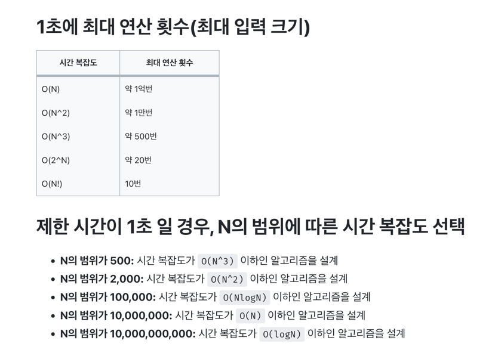

# Problem - 중복문자제거

## KeyWord

- 중복 요소를 어떻게 제거할 것 인가?
- LinkedHashSet (들어온 순서 보장)

## Problem Requirements

- 소문자로 작성된 문자열 중복된 문자 제거 후 출력
- 단, 중복제거된 문자열의 각 문자는 원래 문자열 순서 유지

## Problem Approach Strategy

### 기존전략
- toCharArray()를 사용해서 문자배열을 만든 후, Character 리스트에 추가
- 버블정렬을 응용하여 동일한 문자를 만날경우 remove 메서드로 제거

### 고민
- 버블정렬을 응용하여 다음과 같은 코드를 짜보았다. 

``` java
List<Character> alphabet = new ArrayList<>();
char[] ch = str.toCharArray();
String answer = "";

for (int i = 0; i < ch.length; i++) {
    alphabet.add(ch[i]);
}

// aabbc
int arrayLength = ch.length;
for (int i = arrayLength - 1; i > 0; i--) {
    for (int j = i - 1; j >= 0; j--) {
        if (alphabet.get(i) == alphabet.get(j)) {
            alphabet.remove(i);
        }
    }
}

for (int i = 0; i < alphabet.size(); i++) {
    answer += alphabet.get(i);
}
return answer;
```
- 뒤에서 부터 탐색을 시작하여 일치할 경우 현재 인덱스 i의 값을 지우는 방식으로 구현하였다.
- 하지만 리스트의 크기가 변화가 생겨 예상치 못한 결과가 일어났다(Out of Index, 동일한 인덱스 비교)
- 그래서 중복 제거를 해주는 Set을 이용해서 구현을 해야겠다는 생각을 하게되었다.

### 수정전략
- 그냥 Set은 순서를 보장해 주지 않는다.
    - 따라서 들어온 순서를 보장해주는 LinkedHashSet을 사용하여 구현하자

## My Solution

```java
import java.util.*;

class Main {
    public String solution(String str) {
        String answer = "";
        Set<Character> hash = new LinkedHashSet<>();

        for (Character c : str.toCharArray()) {
            hash.add(c);
        }

        for (Character c : hash) {
            answer += String.valueOf(c);
        }

        return answer;
    }

    public static void main(String[] args) {
        Main T = new Main();
        Scanner kb = new Scanner(System.in);
        String duplicateString = kb.next();
        System.out.println(T.solution(duplicateString));
    }
}
```

## Model Solution

```java
import java.util.*;
class Main {	
	public String solution(String str){
		String answer="";
		for(int i=0; i<str.length(); i++){
			//System.out.println(str.charAt(i)+" "+i+" "+str.indexOf(str.charAt(i)));
			if(str.indexOf(str.charAt(i))==i) answer+=str.charAt(i);
		}
		return answer;
	}

	public static void main(String[] args){
		Main T = new Main();
		Scanner kb = new Scanner(System.in);
		String str=kb.next();
		System.out.print(T.solution(str));
	}
}
```

## Refactoring

```java

```
### 시간복잡도 관련 인사이트

출처 : https://velog.io/@jiyaho/%EC%95%8C%EA%B3%A0%EB%A6%AC%EC%A6%98-%EC%8B%9C%EA%B0%84-%EC%A0%9C%ED%95%9C%EA%B3%BC-%EC%8B%9C%EA%B0%84-%EB%B3%B5%EC%9E%A1%EB%8F%84
- 그림에서는 제한 시간이 1초일 때, N의 범위에 따른 이상적인 시간복잡도를 설명하고 있다.
- 현재 이 문제의 시간 제한은 1초, N을 의미하는 문자열 길이 제한은 100이다.
  - 따라서 다른 시간복잡도 보다 상대적으로 느린 O(N^3) 이하인 알고리즘을 설계해도 문제가 없다는 것이다.
- 앞으로 시간복잡도를 미리 계산해놓고 문제에 접근하자. 
  - 공간 복잡도는 하드웨어의 성능이 좋기 때문에 시간복잡도를 우선해서 풀자.

1. LinkedHashSet의 add() vs String의 IndexOf()
- 나는 LinkedHashSet는 입력 순서를 기억하기에 문자열의 각 문자를 추가하면서 중복을 제거하는 방식으로 구현하였다.
- 강사님은 indexOf를 활용하여 문자가 문자열 내에서 처음 등장하는 인덱스를 찾도록 하고, 현재 검사하는 문자의 인덱스가 indexOf로 찾은 인덱스와 일치한다면, 이는 그 문자가 문자열 내에서 처음 나타나는 경우임을 의미하기에 answer 변수에 누적시켜 최종 문자열을 구성하였다.
- 결론 : 평균 시간 복잡도 = add : indexOf = O(1) : O(N), 최악의 시간 복잡도 = add : indexOf = O(N) : O(N) 이므로 LinkedHashSet을 이용하는 방법이 더 시간이 적게 걸린다.


### 리팩토링 방향
- 조금 더 시간복잡도를 최소화 해보는 방향으로 진행
  - 현재 answer에 문자를 추가할 때마다, 새로운 String 객체가 생성되고 answer는 이 새로운 객체를 가리고 있는 상황
  - 따라서 StringBuilder를 사용하고 appeend로 객체를 직접 수정하는 방향으로 진행

## What I Learned
- N의 범위에 따라 시간복잡도를 고려해 알고리즘을 설계해야 한다는 사실을 알게되었다.
- indexOf()로 중복 문자를 체크하는 방식은 가독성이 좋긴 하나 시간복잡도가 LinkedHashSet이 좋으므로 LinkedHashSet을 이용하자.
- answer를 return 할 때, 계속 String 객체를 생성해서 +=를 하고 마지막 answer 참조변수가 가르키는 객체를 리턴하는 것보다, StringBUilder로 빈 문자열을 생성하고 append() 해주는게 시간복잡도가 더 개선된다.